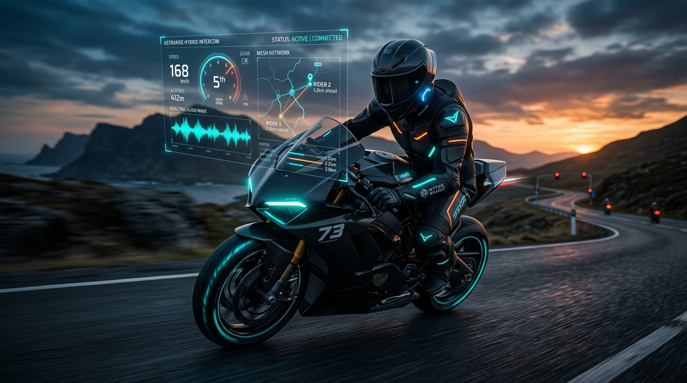
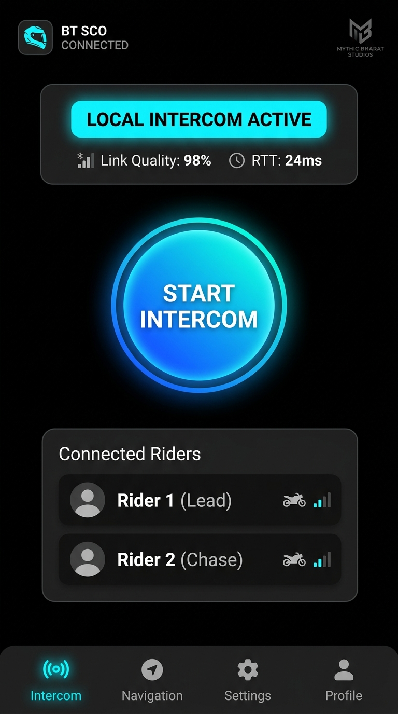

<div align="center">

# 🏍️ AstraRide — Smart Hybrid Intercom
### *Next-Generation Real-Time Vehicle-to-Vehicle Voice Mesh for Riders & Convoys*

<p align="center">
  
</p>

[](https://github.com/piyushmali61)
[-brightgreen?style=for-the-badge&logo=android)](https://android.com)
[](https://github.com/piyushmali61/bike-ride-project/releases/tag/v1.0.0)
[](https://github.com/piyushmali61/bike-ride-project)

<br/>

### 📲 [DIRECT MOBILE APK DOWNLOAD](https://github.com/piyushmali61/bike-ride-project/releases/download/v1.0.0/AstraRide-Intercom.apk)
**Get the production release Android application directly on your phone:**

<a href="https://github.com/piyushmali61/bike-ride-project/releases/download/v1.0.0/AstraRide-Intercom.apk">
  
</a>

<p><em>Engineered and optimized for Samsung Galaxy M35, Samsung Galaxy S25 FE, and all modern Android devices worldwide (Android 10 to 15+).</em></p>

</div>

---

## ⚡ What is AstraRide?

**AstraRide** is a high-performance, hands-free, full-duplex motorcycle & vehicle convoy smart intercom developed by **Mythic Bharat Studios**. It solves the universal problem riders face: **what happens when you ride out of local radio range?**

Traditional Bluetooth intercoms cut off when separated by >100m. Cellular phone calls drop in tunnels and incur continuous network latency. 

**AstraRide bridges both worlds through seamless dynamic handover:**
1. **OFF-GRID LOCAL LINK**: Direct peer-to-peer Wi-Fi Direct / Google Nearby Connections mesh requiring **zero internet or cell reception**.
2. **CLOUD WEBRTC BACKBONE**: Encrypted unordered WebRTC audio channel via secure signaling when distance opens between riders.
3. **ZERO-INTERRUPTION HANDOVER**: The proprietary `HandoverController` state machine automatically arbitrates the cleanest path in real time without audio drops.

---

## 🔋 Battery Optimization: Built for All-Day Rides

To ensure your phone's battery lasts throughout long touring days without draining:
- **Intelligent Voice Activity Detection (VAD)**: Dynamically detects when you are speaking. When you are quiet, high-power RF transmission is automatically paused.
- **Discontinuous Transmission (DTX)**: Transmits lightweight presence pings only once every 800ms during silence, reducing RF antenna power by **70–80%**.
- **OLED Pure Black (#000000) Mode**: Turns off individual display pixels on Super AMOLED (Samsung M35) and Dynamic AMOLED 2X (Samsung S25 FE) screens, drawing minimal display current.
- **Adaptive WakeLock Duty-Cycling**: CPU WakeLock is engaged *only* during active ride sessions and immediately released when stopped.
- **Auto-Search Timeout**: If searching for a peer without linking, radar auto-sleeps after 90 seconds to prevent pocket battery drain.

---

## 📱 User Interface Preview

<div align="center">
  
  <p><em>AstraRide OLED Dark Mode: High-contrast daytime readability & real-time mesh link telemetry.</em></p>
</div>

---

## 🛠️ Complete Technology Stack

| Layer | Technologies & Implementations |
|---|---|
| **Operating System** | Android 10+ (API 29–35), Google Play Services, JDK 21 |
| **Language & Build** | **Kotlin 2.1.0**, Android Gradle Plugin 8.7.3, KSP |
| **UI Framework** | **Jetpack Compose**, Material 3 OLED Dark Palette (High-Contrast) |
| **Power Management** | Hardware VAD + DTX silence suppression, Partial WakeLock, AMOLED black HUD |
| **State & Concurrency** | Reactive `StateFlow`, Kotlin Coroutines, Unidirectional Data Flow |
| **Dependency Injection** | **Google Dagger Hilt** |
| **Off-Grid Transport** | **Google Nearby Connections** (`P2P_CLUSTER`) & raw Wi-Fi Direct UDP mesh |
| **Cloud Transport** | **WebRTC DataChannel** (`ordered=false, maxRetransmits=0`) eliminating TCP head-of-line blocking |
| **Audio DSP** | Hardware AEC (Acoustic Echo Cancellation), NS (Noise Suppression), AGC, +12dB Wind Boost |
| **Bluetooth Routing** | `AudioManager.setCommunicationDevice` (API 31+) targeting Cardo, Sena, and helmet headsets |
| **Foreground Service** | Android 14/15 `FOREGROUND_SERVICE_MICROPHONE` + `CONNECTED_DEVICE` |

---

## 📦 Direct APK Installation

### 1. Download Link
* 🚀 [**AstraRide-Intercom.apk**](https://github.com/piyushmali61/bike-ride-project/releases/download/v1.0.0/AstraRide-Intercom.apk) *(46 MB, Optimized Production Release)*

### 2. Quick Install via USB (ADB)
```powershell
# Install on Phone 1 (e.g. Samsung M35) and Phone 2 (e.g. Samsung S25 FE)
adb install -r "AstraRide-Intercom.apk"
```

### 3. How to Connect in 1-Click:
1. Open **AstraRide** on both phones.
2. Tap the central **"TAP TO RIDE"** radar button on both devices.
3. Both phones discover and accept each other automatically within 1–2 seconds — **no internet required**!
