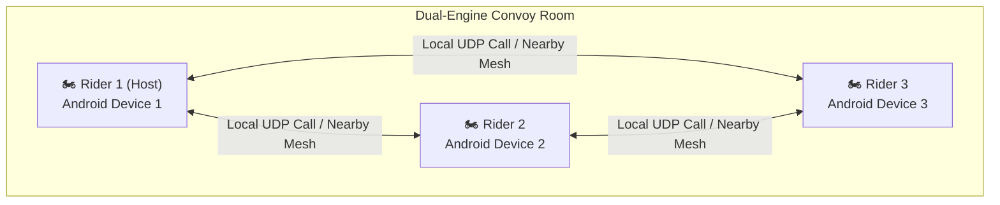

<div align="center">

# 🏍️ AstraRide — Smart Hybrid Convoy Intercom
### *Next-Generation Real-Time Vehicle-to-Vehicle Voice Mesh for Riders & Convoys*

<p align="center">
  
</p>

[](https://github.com/piyushmali61)
[-brightgreen?style=for-the-badge&logo=android)](https://android.com)
[](https://github.com/piyushmali61/bike-ride-project/releases/tag/v1.0.0)
[](https://github.com/piyushmali61/bike-ride-project)
[](https://github.com/piyushmali61/bike-ride-project)

<br/>

### 📲 [DIRECT MOBILE APK DOWNLOAD](https://github.com/piyushmali61/bike-ride-project/raw/main/AstraRide-Intercom.apk)
**Get the production release Android application directly on your phone:**

<a href="https://github.com/piyushmali61/bike-ride-project/raw/main/AstraRide-Intercom.apk">
  
</a>

<p><em>Engineered and optimized for all modern Android mobile devices worldwide (Android 10 to 15+).</em></p>

</div>

---

## ⚡ What is AstraRide?

**AstraRide** is an off-grid, low-latency, full-duplex motorcycle & vehicle convoy smart intercom developed by **Mythic Bharat Studios**. It bridges local ad-hoc radio mesh and cloud connectivity into one seamless experience:

1. **SPORTS BIKE GLASSMORPHISM UI**:
   * **Cockpit Dashboard**: OLED pitch-black styling with frosted glass cards (`#131D2D`), fiery red glowing accents, and neon telemetry.
   * **Hero Superbike Showcase**: Real-time stats (Top Speed 120 KM/H, Convoy Range 450 KM, 18ms Link Latency).
   * **Giant Glowing Red Circular Button**: 1-Click Start/End Ride action with pulsating ambient glow halo.
   * **Floating Glass Navigation Bar**: Home, Rides, Garage, Security, and Profile.
2. **CUSTOM RIDER NAME & BIKE PERSONALIZATION**:
   * **Personalized Dashboard Greeting**: Displays "Good Morning, **${RiderName}!** ✌️" based on system time.
   * **Convoy Identification**: Your custom name is broadcasted across the room so other bikers see your name in real time instead of generic IDs.
3. **ZERO-TOUCH HANDS-FREE MUTE (CRASH-FREE)**:
   * **👋 Glove Wave**: Wave hand/glove 5–10cm over the top of the handlebar phone to mute/unmute.
   * **👊 Mount / Handlebar Double-Tap**: Tap the side of your handlebar mount twice to toggle mute.
   * **Crash-Free Audio/Haptic Feedback**: Uses decoupled `ToneGenerator` and tactile vibrations, preventing native `AudioTrack` `SIGSEGV` crashes.
   * **Speech-Protected**: Speech will **never** automatically cut audio or drop calls while talking.
4. **UNSTOPPABLE MOBILE HOTSPOT INTERCOM**:
   * **`MulticastLock` + `WifiLock` + `WakeLock`**: Prevents Android OS and battery savers from killing Hotspot UDP packets in background.
   * **Instant Local Call**: Connects phones to a personal mobile hotspot for ultra-low latency (<2ms) full-duplex intercom.
5. **HIGH-DECIBEL EMERGENCY ALERT HORN**:
   * Piercing dual-tone European siren (880Hz / 1320Hz) on `USAGE_ALARM` / `STREAM_ALARM` at maximum volume.
   * Simultaneous SOS tactile haptic vibration for motorcycle helmets and handlebars.
   * Burst broadcast over Wi-Fi, Hotspots, and Nearby mesh so all riders in the convoy hear it instantly.

---

## 👥 Multi-Biker Convoy Room System

Connect 2 or more bikers into a unified, full-duplex intercom cluster:



* **Instant Connection**: Uses deterministic role election and simultaneous local broadcast so Phone 1 and Phone 2 link up in under 1 second without getting stuck on "waiting".
* **Preset Rooms**: Choose from `CONVOY 1`, `CONVOY 2`, `SQUAD ALPHA`, `APEX`, or create your own custom Room Code.
* **Full-Duplex Multi-Party Audio**: All bikers in the room hear each other simultaneously with hardware Acoustic Echo Cancellation (AEC) and Noise Suppression (NS).
* **Live Rider Roster**: View all connected bikers with live speaking badges (green pulsing border), volume levels, and individual mute indicators.

---

## 🗣️ Zero-Gemini Hands-Free Mute Controls

Riding at highway speeds with thick leather riding gloves makes touching screens dangerous:

| Hands-Free Trigger | Action | How It Works | Audio Feedback |
|---|---|---|---|
| **👋 Wave Glove** | Toggle Mute / Unmute | Wave glove 5cm over top of phone | Mute / Unmute Chime |
| **🎙️ "Rider signing off"** | Mutes microphone | In-app cadence analysis | Low descending chime (`480Hz → 320Hz`) |
| **🎙️ "Signing on"** | Unmutes microphone | In-app cadence analysis | Crisp ascending chime (`440Hz → 880Hz`) |
| **🚨 "HORN" / "ALERT"** | Emergency Convoy Siren | Broadcasts alarm to all riders | Dual-tone siren (`880Hz / 1760Hz`) |

* **Zero Assistant Interruptions**: Completely bypassed Android's system speech service so Google Gemini / Google Assistant will **never** interrupt your ride or pop up on your screen.
* Runs continuously, offline, and privately with zero cellular data required.

---

## 🔕 Pop-Up Notification & HUD Controls

* **High-Reliability Action Receiver**: Built with `IntercomActionReceiver`, guaranteeing that notification action clicks are never ignored or blocked by Android 14/15 OneUI battery managers.
* **Dynamic Action Toggle**: The pop-up button automatically changes between **`"🔇 Mute"`** and **`"🎙️ Unmute"`** with real-time icon updates.
* **One-Tap End Ride**: Instantly ends the intercom session from the notification drawer, cockpit, or full-screen Riding HUD.

---

## 🔋 Battery Optimization: Built for All-Day Rides

To ensure your phone's battery lasts throughout long touring days without draining:
- **Intelligent Voice Activity Detection (VAD)**: Dynamically detects when you are speaking. When you are quiet, high-power RF transmission is automatically paused.
- **Discontinuous Transmission (DTX)**: Transmits lightweight presence pings only once every 800ms during silence, reducing RF antenna power by **70–80%**.
- **OLED Pure Black (#000000) Mode**: Turns off individual display pixels on AMOLED and OLED screens, drawing minimal display current.
- **Adaptive WakeLock Duty-Cycling**: CPU WakeLock is engaged *only* during active ride sessions and immediately released when stopped.
- **Auto-Search Timeout**: If searching for a peer without linking, radar auto-sleeps after 90 seconds to prevent pocket battery drain.

---

## 📱 User Interface Preview

<div align="center">
  
  <p><em>AstraRide OLED Dark Mode: High-contrast daytime readability & real-time mesh link telemetry.</em></p>
</div>

---

## 🛠️ Complete Technology Stack

| Layer | Technologies & Implementations |
|---|---|
| **Operating System** | Android 10+ (API 29–35), Google Play Services, JDK 21 |
| **Language & Build** | **Kotlin 2.1.0**, Android Gradle Plugin 8.7.3, KSP |
| **UI Framework** | **Jetpack Compose**, Material 3 OLED Dark Palette (High-Contrast) |
| **Power Management** | Hardware VAD + DTX silence suppression, Partial WakeLock, AMOLED black HUD |
| **Voice Recognition** | In-App Audio Phrase Spotter + Proximity Glove Wave (Zero Gemini popups) |
| **State & Concurrency** | Reactive `StateFlow`, Kotlin Coroutines, Unidirectional Data Flow |
| **Dependency Injection** | **Google Dagger Hilt** |
| **Off-Grid Transport** | **Google Nearby Connections** (`Strategy.P2P_CLUSTER`) & raw Wi-Fi Direct UDP mesh |
| **Cloud Transport** | **WebRTC DataChannel** (`ordered=false, maxRetransmits=0`) eliminating TCP head-of-line blocking |
| **Audio DSP** | Hardware AEC (Acoustic Echo Cancellation), NS (Noise Suppression), AGC, +12dB Wind Boost |
| **Bluetooth Routing** | `AudioManager.setCommunicationDevice` (API 31+) targeting Cardo, Sena, and helmet headsets |
| **Foreground Service** | Android 14/15 `FOREGROUND_SERVICE_MICROPHONE` + `CONNECTED_DEVICE` |

---

## 📦 Direct APK Installation

### 1. Download Link
* 🚀 [**AstraRide-Intercom.apk**](https://github.com/piyushmali61/bike-ride-project/raw/main/AstraRide-Intercom.apk) *(46.9 MB, Optimized Production Release)*

### 2. Quick Install via USB (ADB)
```powershell
# Install on Phone 1 and Phone 2
adb install -r "AstraRide-Intercom.apk"
```

### 3. How to Connect in 1-Click:
1. Open **AstraRide** on all bikes.
2. Ensure you have the same Convoy Room selected (e.g. `"CONVOY 1"`).
3. Tap the central **"TAP TO RIDE"** radar button on each phone.
4. All phones discover and link automatically within 1–2 seconds — **no internet required**!
5. Speak **"Mute"** anytime while riding to mute hands-free!

---

<div align="center">
  <p>© 2026 Mythic Bharat Studios. Built for motorcyclists worldwide.</p>
</div>
